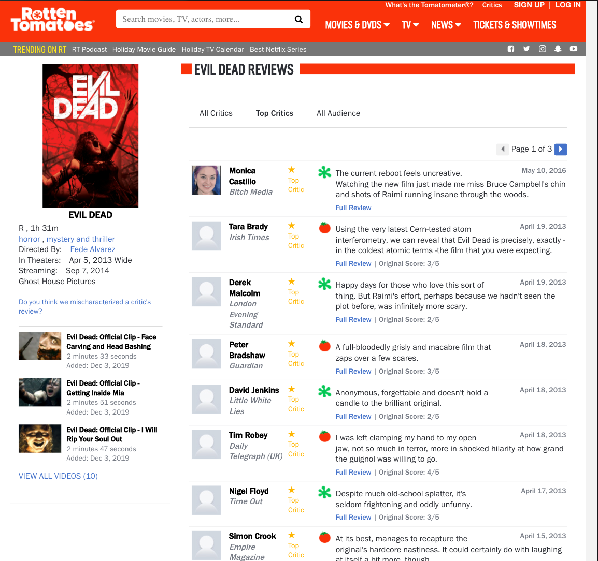

# Movie Critic Web Scraper

A web scraper written in node.js that, given a list of properly formatted movie titles (see movies.txt) scrapes rotten tomatoes top critics and converts them into a usable JSON file. It also produces a JSON file of those movies along with URLs to their official movie posters. This web scraper is what powers [Movie Critic Matchmaker](www.moviecriticmatchmaker.com) which is also open-sourced [here](https://github.com/mixophrygian/movie-critic-matchmaker).

Going from this...



...to this:

```
[
  {
    "name": "Derek Malcolm",
    "movies": [
      { "title": "Evil Dead", "broadRating": "rotten" },
      { "title": "Rubber", "broadRating": "rotten" },
      { "title": "Diary of a Wimpy Kid", "broadRating": "rotten" },
      { "title": "Paul", "broadRating": "fresh" },
      { "title": "She's Out of My League", "broadRating": "rotten" },
      { "title": "The Book of Eli", "broadRating": "rotten" },
      { "title": "The Expendables", "broadRating": "fresh" },
      { "title": "Spring Breakers", "broadRating": "rotten" },
      { "title": "Super", "broadRating": "rotten" }
    ]
  },
  {
    "name": "Peter Bradshaw",
    "movies": [
      { "title": "Evil Dead", "broadRating": "fresh" },
      { "title": "Hobo With a Shotgun", "broadRating": "rotten" },
      { "title": "Enemy", "broadRating": "fresh" },
      { "title": "Climax", "broadRating": "fresh" },
      ...etc
```

# How to use

1. `npm install`
2. Delete the contents of `rawCriticObjects.json` and replace with an empty array
3. Head on over to https://www.omdbapi.com and request an API key. This free API will fetch movie poster URLs for the `moviesWithFullData.json` file.
4. `./getEmAll.sh <your OMDB api key>`

To only add a single movie, run `node scrapeRT.js <movie title>`. Make sure your movie title matches the URL formatting that rotten tomatoe uses AND (if it's a remake) has the year appended, e.g. `The_Addams_Family_2019`

Happy scraping!
